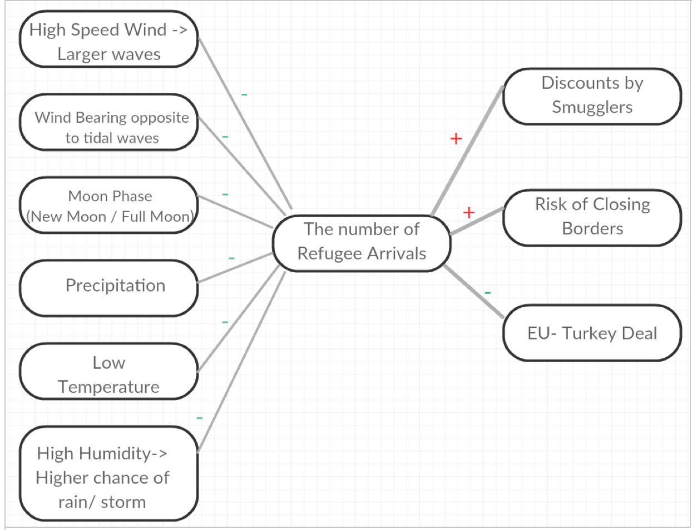
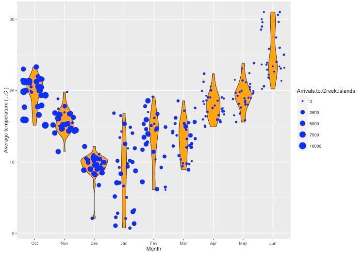
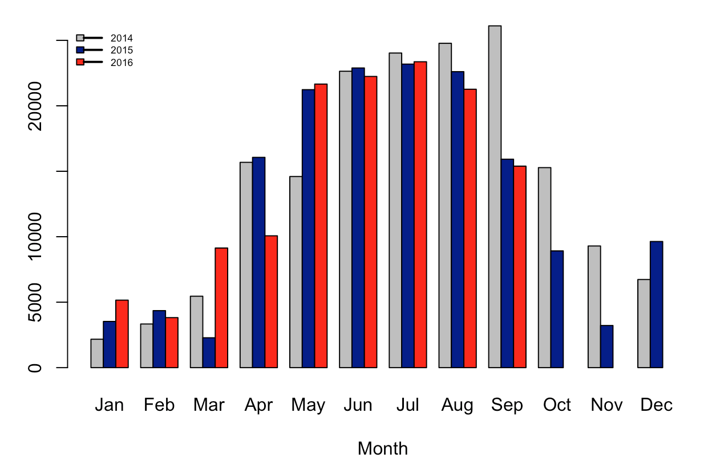

```{r knitr_init, echo=FALSE, cache=FALSE}
library(knitr)
library(rmdformats)

## Global options
options(max.print="75")
opts_chunk$set(echo=FALSE,
	             cache=TRUE,
               prompt=FALSE,
               tidy=TRUE,
               comment=NA,
               message=FALSE,
               warning=FALSE)
opts_knit$set(width=75)
```

#1. Introduction

Since September 2015, the British Red Cross (BRC) developed a number of projects to anticipate the number of refugee arrivals and their flows in Europe. This project was commissioned to investigate the effect of weather conditions on refugee arrivals. Our focus is on the final part of refugees journey to Europe (by boat) and the impacts of weather conditions on their sea trip.

Our aim is to explore if we can make reasonably good predictions based on very little data that can be of help to policy makers, NGOs and other interested parties. For these groups, it's necessary to understand the dynamics behind weather conditions and refugee arrivals. Policy makers either want to hinder refugees (make it more difficult for them to arrive) or help them (make sure that they're not stuck in places where they might die). NGO's want to provide better services. The EU wants to make sure that refugees don't travel when it's bad weather (they do, and many die). 

This document is structured as follows. In section 2, we outline our research questions and project goals, followed by an overview of our approach in section 3. In turn section 4 discuss about the  background research and derive from that our theoretical variables. Section 5 represents an overview of the number of refugee arrivals to Greece and Italy. In section 6 we explain the process of data collection which is mainly focused on weather- related data. Then we perform an exploratory data analysis on available data. In section 8, we construct several models aimed at finding the most relevant variables. Finaly, we summarize our results and suggest for follow-up projects.


#2. Problem Statement and project goals
The project goals are as follows:

* Gain a better understanding of UNHCR refugee arrival data. That is, try to better understand the limitations of the dataset.
* Analyze the relationship between weather status and the number of arrivals to Europe to see if we can make somewhat accurate predictions about number of arrivals
* Identify relevant predictors
 
The sub-questions which lead to the main goals are:

* How is the quality of data?
* How strong, if any, is the relationship between weather status and the number of arrivals to Europe?
* In case of any relationship, which weather parameters impact the number of refugee arrivals the most? 

#3. Approach
To tackle this problem we create two models. The first model contains theoretical variables. That is, it contains variables that are identified as important through our investigation about weather conditions that may have encouraging/ discouraging impact on the flow of refugees. The second model performs variable selection on our dataset and hence selects  best predictors . This serves as a  black box  model; if it turns out that our theoretical variables are not related to the number of refugees, it indicates that we should consider an alternative approach .

#4. Background and theoretical variables
In this section, we discuss the results of our research on weather- related parameters and other important factors  that theoretically influence the number of refugee arrivals. 

##4.1. Weather-related parameters
Our research about weather-related parameters address the following questions:

* Do weather conditions encourage or discourage refugees to start their journey, and, if so, which conditions have the highest impact on refugee arrivals?
* Which weather parameters are related to the most intercepting/ helping weather conditions on refugees  way?


To answer the former question, we explored several interviews  with refugees performed by non-profit organizations and charities such as Save the Children and  The UN Refugee Agency (UNCHR) .  According  to refugees strong winds[^1] , stormy weather[^2] and rough/choppy sea [^3] are considered as risky weather conditions to cross the sea. 


The following details regarding these weather conditions clarify the answer of the latter question.

* Wind which is measured by its speed and direction.

* Rough water / choppy sea


      +  Wind is the most significant influencing factor in making a rough water. The wind starts rippling the water and gradually create waves. If the wind continues to remain constant in strength waves roll along and may tend to get larger [^4]. 


      + Tide is another factors that affects waves on inshore waters If there is a tidal flow or current in one direction and a wind blowing and making waves from an opposite direction, the waves will tend to stand up as the two forces meet. These types of waves can be quite powerful, uncomfortable and dangerous[^4].  


      + Other factors such as the underwater topography has impact in the formation of the waves. 


* Storm 

     + There are very different types of storms. According to storm definition,  they are marked by significant disruptions to normal conditions such as strong wind, hail, thunder and lightning (a thunderstorm), heavy precipitation (snowstorm, rainstorm), heavy freezing rain (ice storm), strong winds (tropical cyclone, windstorm), or wind transporting some substance through the atmosphere as in a dust storm, blizzard, sandstorm, etc. [^5]  The strength of wind varies in different storms.  The average wind speed during a thunderstorm depends on temperature, humidity, topography and the phase of the storm itself. It s strongest when the storm is producing the most rain and lightning [^6].

##4.2. Other important features in refugees inflow to Greece
In our study we found a difference in the impact of weather conditions on refugees inflow to Greece and Italy (see Exploratory data analysis section). Many presumed that the influx of refugees to Greece would decrease in winter 2015 due to a high  risk of journey across the Aegean from Turkey to Greece. However, evidences show that there are more influencing factors than weather conditions on the number of refugee arrivals. Some of these factors are as follows:

* Poor weather means a discount

Many anecdotes from refugees declare that traffickers keep the demand high by offering seasonal discount in winter[^7] which causes people risk their lives at sea. There are also some quotes from refugees that the smugglers don't travel with them; they sometimes hold back a family member as a hostage, to get a refugee to bring the boat back.[^1] 

* Risk of closing borders

According to Carlotta Sami, spokeswoman at UN refugee agency for southern Europe, the surge in numbers of refugees in bad weather is due to their fears that European borders will close once they reach northern Europe[^8].

* Turkey Deal

Following the EU-Turkey agreement signed on 18 March 2015 a sharp reduction of the illegal migration flows was seen[^9]. This agreement which was aimed to end the irregular migration from Turkey to the EU, was successful in tackling this issue to a large extend.

##4.3. Summary
Figure1. represents the factors with the most impact on the number of refugee arrivals. Thickness of the lines show their approximate weights. Positive and negative signs show whether a factor causes an increase or decrease in the number of refugee arrivals. According to available documents mentioned earlier, factors with no relation to weather conditions, such as discounts by traffickers as well as risk of closing borders in winter time were more influential. These factors had more encouraging impact on the flow of refugees rather than intercepting impact of bad weather.



 
#5. An overview of refugee arrivals to Greece and Italy
Analyzing dataset of the number of arrivals to Greece from October 2015 - June 2016, approves our findings of our research. As it was expected, in winter 2015, the refugee influx did not get slower due to bad weather. On the other hand, the impact of EU-Turkey deal is clearly visible in the decreased number of arrivals from March 2016.




When it comes to refugee arrivals to Italy, as it can be seen in Figure3. there is a pattern in the number of arrivals in 2015 and 2016. It seems this pattern is more influenced by weather conditions.




###How to proceed? 
As a conclusion, we decided to further our analysis about the impact of weather conditions on the number of arrivals using Italy dataset. Furthermore, this analysis is focused on the period between Oct 2015 and September 2016. 


#6.Data collection 
There is a dataset and an API available for this analysis, a dataset of the number of arrivals published by the United Nations High Commissioner for Refugees (UNHCR)[^10] and a weather forecast history API, Dark Sky API [^11]. Dark Sky API returns the observed hour-by-hour and daily weather conditions for a particular date in a given area.

In this study our focus is on finding the weather conditions that may encourage/ discourage refugees to start their journey, rather than conditions that may influence traveling time. Therefore, we need to identify coastal migrant hubs and the traveling time from those hubs to destinations (in this case Italy).

According to Zeit-Online [^12], main refugees are coming from Libya, Tunisia and Egypt. In Libya, Tripoli [^13] and Benghazi [^14] are the main ports from which it takes at least 3 days [^15] to Italy. Traveling from Egypt ,Kafr-al-Sheikh  and Alexandria, to Italy takes more than 10 days and there are evidences of 13 days on board.


As you can see in Figure4. Tripoli is the largest migrant hub to Italy. For sake of simplicity, we start with analyzing Tripoli data assuming that it is a 3-day trip.

##6.1. Weather API data points
Considering the weather parameters mentioned above, the followings are the related variables available in Dark Sky API. These variables are theoretically the most influencing factors on the number of refugee arrivals.


 * Wind Speed : The wind speed in miles per hour
 
 * Wind Bearing : The direction that the wind is coming from in degrees, with true north at 0° and progressing clockwise. 

 * Moon Phase: a value of 0 corresponds to a new moon, 0.25 to a first quarter moon, 0.5 to a full moon, and 0.75 to a last quarter moon. 

  This variable is related to tides. Tides are known as the patterns of rising and falling           the sea level caused by the gravitational forces of the Sun and Moon.  Because the tides are influenced by both the Moon and the Sun, it's easy to see that when the Sun lines up with the Moon and the Earth, as during a New Moon or Full Moon, the tidal effect is increased, called spring tides  . On the other hand, during the First or Third Quarter Moon, the Sun and the Moon are 90 degrees apart in relation to an observer on Earth. So gravity of Sun works against the gravity of Moon and the height of the tides are in minimum, called neap tides. The interval between spring and neap tides are about seven days.


 * Precipitation Type: The type of precipitation occurring at the given time. If defined, this property will have one of the following values: "rain", "snow", or "sleet" (which refers to each of freezing rain, ice pellets, and  wintery mix ).

 * Apparent Temperature Max/ Min: Maximum and minimum of apparent temperatures in Fahrenheit.

 * Humidity: The relative humidity, between 0 and 1, inclusive.

#7. Exploratory data analysis
##7.1. Data Quality
```{r, echo=FALSE}
data <-read.csv2('data/arrival-Italy.csv')
data <- data[,c(1,2)]
data$Date <- as.Date(data$Date, format='%m/%d/%y')
data$Arrivals.to.Italy <- gsub("\\.","",data$Arrivals.to.Italy)
data$Arrivals.to.Italy<-as.numeric(data$Arrivals.to.Italy)
data$month<- format(data$Date,'%b')
data$year<- format(data$Date,'%Y')
 data$month<-factor(data$month, levels=c('Jan',   'Feb',   'Mar',    'Apr',    'May',    'Jun',    'Jul',    'Aug',    'Sep',    'Oct',   'Nov',   'Dec'))
```
###7.1.1. UNCHR data
Quality of data is evaluated in terms of arrival numbers registered per day. As it can be seen in the following diagram, in a large proportion of this dataset (more than 40% of days), no refugee is registerd in Italy. Although there is a possibility of missing data in those days (data error), because of the following reasons we take zeros as valid data points.

1. We can consider a pattern in zero/ close to zero data points. In cold months of the year, days with very limited number of arrivals are much more frequent than other months.

2. It is a 3-4 days sea-trip from Libya to Italy. While in some days ships arrive with large number of refugees, in other days no ship arrives.


```{r, echo=FALSE, warning=FALSE, message=FALSE}
data$val <- ifelse(is.na(data$Arrivals.to.Italy),'NULL',
                   ifelse(data$Arrivals.to.Italy==0,'0',
                     ifelse( ((data$Arrivals.to.Italy>0)&(data$Arrivals.to.Italy<100)),'0<Value<100',                                       ifelse(((data$Arrivals.to.Italy>=100)&(data$Arrivals.to.Italy<500)),                                                   '100<Value<500', 'Value>500'))))

data$val <- as.factor(data$val)

library('ggplot2')
library('RColorBrewer')
ggplot(data,aes(month,fill=val)) + geom_bar(position='fill') + scale_fill_manual(values = (brewer.pal(5, "Greens"))) + 
  facet_wrap(~year,ncol=1) + coord_flip() + ylab('Prercentage')+ggtitle('Distribution of Refugee Arrivals per Day')
```

###7.1.2.Dark Sky API data
Regarding the quality of data extracted  from the weather forecast history API, it includes some columns with more than 50% null values.Observations that include null values will be ignored by machine learning algorithms. So we will loose a large amount of data in case of keeping these columns. On the other hand, imputing missing data with replacement values such as mean values is not an accurate approach due to the large percenatage of missing data in each column. Therefore, we decided to remove these columns. In this case we miss some predictors in favour of having more observations and more accurate result.

```{r, echo=FALSE, warning=FALSE}
libya.data <- read.csv2('data/libya.csv')
libya.data <- libya.data[,-1]

#Remove Columns with more than 30% Null values
s <- sapply(colnames(libya.data), function(x) 
                                    ifelse((sum(is.na(libya.data[,x]))/ nrow(libya.data))> 0.3,
                                    '',x) )
columns.with.values <- as.character(s[(as.character(s)!='')])
libya.data <- libya.data[,columns.with.values]

#Convert types of columns from character to integer
libya.data[, c(4:6,8:15)] <- sapply(libya.data[, c(4:6,8:15)], as.numeric)


## Some filling on Min/Max temperature data
cond.min.temp.na <- is.na(libya.data$temperatureMin1) & !is.na(libya.data$apparentTemperatureMin1)
libya.data[cond.min.temp.na,'temperatureMin1']<- libya.data[cond.min.temp.na,'apparentTemperatureMin1']

cond.max.na <- is.na(libya.data$temperatureMax1) & is.na(libya.data$apparentTemperatureMax1)
libya.data[cond.max.na,'temperatureMax1']<- libya.data[cond.max.na,'temperatureMin1']
libya.data[cond.max.na,'apparentTemperatureMax1']<- libya.data[cond.max.na,'apparentTemperatureMin1']


cond.max.temp.na <- is.na(libya.data$temperatureMax1) & !is.na(libya.data$apparentTemperatureMax1)
libya.data[cond.max.temp.na,'temperatureMax1']<- libya.data[cond.max.temp.na,'apparentTemperatureMax1']

cond.min.na <- is.na(libya.data$temperatureMin1) & is.na(libya.data$apparentTemperatureMin1)
libya.data[cond.max.na,'temperatureMin1']<- libya.data[cond.max.temp.na,'temperatureMax1']
libya.data[cond.max.na,'apparentTemperatureMin1']<- libya.data[cond.max.temp.na,'apparentTemperatureMax1']
libya.data <- na.omit(libya.data)

#precipType1 has only value of 'rain', so I remove it from our predictors
libya.data$precipType1 <- NULL

## Normalize data
libya.scaled <- scale(libya.data[,c(-1,-2,-3)])
libya.data <- cbind(libya.data[,c(1,2,3)],libya.scaled)
```

##7.2. A snapshot of all predictors
Here is a snapshot of available variables after cleaning data.
```{r, echo=FALSE}
knitr::kable(head(libya.data))
```

#8. Modeling

##8.1. Evaluation Method
Our model evaluation is based on k-fold Cross Validations (CV). We use an average of k (in our case the number of folds is equal to 10) Root-Mean Square Error (RMSE) as evaluation metrics for our models.

##8.2. Linear Models
###8.2.1. Linear model using theoretical variables
In the eraly stage of this project we investigated about the weather parameters that may impact inflows of refugees. Here, we create a simple linear model using variables that are considered as the most important ones in that theoretical analysis. This model includes 5 predictors including wind speed, wind bearing, moon phase, minimum apparent temperature, and humidity.

```{r, echo=FALSE}
columns.theory.noOutput <- c( 'windSpeed1','windBearing1','moonPhase1','apparentTemperatureMin1','humidity1')
columns.theory <- c('Arrivals.to.Italy', columns.theory.noOutput)

library('boot')
set.seed(1)
glm.theory <- glm(Arrivals.to.Italy~.,data=libya.data[,columns.theory])
cv.glm.theory<- cv.glm(libya.data[,columns.theory],glm.theory,K=10)
```

The results are as follows: Theoretical Model RMSE is equal to `r round(sqrt(cv.glm.theory$delta[1]), digits=3)`. Summary of this model (see below) shows in most of the cases standard errors are relatively high and in some cases even larger than their coefficients. It could be due to a large collinearity among variables. Other reasons could be that the coefficients are not well estimated or the coefficients are close to zero.
 
```{r, echo=FALSE}
summary(glm.theory)
```

The following table shows the correlation among the predictor variables. It seems none of the variables are highly correlated.

```{r, echo=FALSE}
library(gclus)
dta <- libya.data[,columns.theory.noOutput] # get data 
dta.r <- abs(cor(dta)) # get correlations
knitr::kable(dta.r)
```

#### conclusion
So, we can say that either the variables are not relavant (specially 'WindBearing' and 'humidity' with std. Error larger than estimate) or linear model is not a descriptive model for this dataset. In the next steps we make two other models: 1. a linear model using all available variables and 2. a linear model using selected variables by a Lasso model. Then we compare all three models measuring their RMSE.

###8.2.2. Linear model with all variables
Here we make a simple linear model using all available predictors and compare its RMSE with the one from theoretical variables.

```{r, warning=FALSE, echo=FALSE}
##Make dummy variable for a categorical predictor (icon1)
icon<- libya.data$icon1
icon.dummy <- model.matrix(~icon)[,-1]
libya.data.with.dummy <- cbind(libya.data[,-3], icon.dummy) # column 3 is icon

library(gclus)
dta <- libya.data.with.dummy[,-1,-2] # get data 
dta.r <- abs(cor(dta)) # get correlations
#knitr::kable(dta.r)
##Make a linear model 
set.seed(1)
var.to.remove <- c(1,5,6,7,9)
glm.linear <- glm(Arrivals.to.Italy~.,data=libya.data.with.dummy[,-var.to.remove])
cv.glm.linear<- cv.glm(libya.data.with.dummy[,-1],glm.linear,K=10)
```

As a result, linear Model RMSE is equal to `r round(sqrt(cv.glm.linear$delta[1]), digits=3)`

###8.2.3. Lasso Model
Lasso model performs both variable selection and regularization in order to enhance the prediction accuracy and interpretability of the statistical model it produces. We applied cross-validation on our dataset to find the optimum tuning parameter, $\lambda$, and make a lasso model. After shrinking the size of predictors using lasso model, we make a linear model and evaluate the model by measuring RMSE.

As the following diagram shows, increasing $\lambda$, does not cause a considerable decrease on MSE. Consequently, shrinkage variable is not significant. It could be an evidance for irrelevant / missing variables. For example, because of the selected region (Tripoli, Libya) or selected length of sea trip from Tripoli to Italy (current assumption is 3 days).

```{r, warning=FALSE, message=FALSE, echo= FALSE}
x = model.matrix(Arrivals.to.Italy~.,libya.data.with.dummy[,c(-var.to.remove)])[,-1]  ##-1 Not include intercept
y= libya.data$Arrivals.to.Italy

# Find optimum Lambda using cross validation
library('glmnet')
set.seed(1)
cv.out = cv.glmnet(x,y,alpha=1)
plot(cv.out)
```

```{r, echo=FALSE, warning=FALSE, message=FALSE}
lamda.min = cv.out$lambda.min
lasso.model =glmnet(x,y,lambda=lamda.min,alpha = 1)
pred.coef <-  predict(lasso.model,s = lamda.min, type='coefficients')
#knitr::kable(pred.coef[1:13,])
##here are predictors selected by lasso

lasso.variables <- c('Arrivals.to.Italy','visibility1','apparentTemperatureMin1','windSpeed1','moonPhase1','iconpartly-cloudy-night','cloudCover1','humidity1')

set.seed(1)

glm.lasso <- glm(Arrivals.to.Italy~.,data=libya.data.with.dummy[,lasso.variables])
cv.glm.lasso<- cv.glm(libya.data.with.dummy[,lasso.variables],glm.lasso,K=10)
```

Mean square error of a linear model made by Lasso-selected variables is `r round(sqrt(cv.glm.lasso$delta[1]), digits=3)`. Large MSE, i.e. 600,000 refugees may represent a biased model that needs an improvement. 

The selected predictors are as follows: 
```{r, warning=FALSE, message=FALSE, echo=FALSE}
selected.predictors.Lasso <- c('visibility1','apparentTemperatureMin1','windSpeed1','moonPhase1','iconpartly-cloudy-night','cloudCover1','humidity1')
knitr::kable(selected.predictors.Lasso)
```

###8.2.4. Models Comparison 
+  Despite of poor results, Lasso model (with 7 predictors) has the best results among all above mentioned models. Therefore, rest of analysis is based on variables in this model.

+  Theoretical model includes 5 predictors among which 4 is in common with Lasso model. 

##8.3. Model improvements

###8.3.1. Residual plot analysis
To understand and improve our selected regression model we perform an analysis on the residual plot. 
Here is a residual plot of a linear model using Lasso-selected variables.
```{r, echo=FALSE}
ihs <- function(x) {
    y <- log(x + sqrt(x ^ 2 + 1))
    return(y)
}

glm.lasso2 <- glm(ihs(Arrivals.to.Italy)~.,data=libya.data.with.dummy[,lasso.variables])
pred.val2 <- predict(glm.lasso2)
plot(pred.val2,glm.lasso2$residuals, xlab = 'Predicted Values', ylab = 'Residuals')
```


As it can be seen in this model, two patterns are recognizable in this plot. We guess that the line represents days with zero arrivals. It could be interpreted as following. It is a 3-4 days sea-trip from Libya to Italy. While in some days ships arrive with large number of refugees, in other days no ship arrives. 


###8.3.2.Smoothing

One of the solutions to uniform our dataset is smoothing. Smoothing methods attempt to capture important patterns in the data, while leaving out noise or other fine-scale structures/rapid phenomena[^16]. 

Among smoothing methods, Simple Moving Average (SMA) is the method that we found as the best fit to our dataset. SMA is calculated based on unweighted mean of the previous *n* data.

```{r, echo=FALSE}
library('TTR')

libya.data.with.dummy$sm.Arrivals <- SMA(libya.data.with.dummy$Arrivals.to.Italy,5)

libya.data.with.dummy2<- na.omit(libya.data.with.dummy)
colnames(libya.data.with.dummy2)[17]<-'iconpartlyCloudyNight'

lasso.variables <- c('sm.Arrivals','visibility1','apparentTemperatureMin1','windSpeed1','moonPhase1','iconpartlyCloudyNight','cloudCover1','humidity1')

glm.lasso.smooth.ihs <- glm(ihs(sm.Arrivals)~.,data=libya.data.with.dummy2[,lasso.variables])

glm.lasso.smooth <- glm(sm.Arrivals~.,data=libya.data.with.dummy2[,lasso.variables])

#par(mfrow=c(1,2))
predict.ihs <- predict(glm.lasso.smooth.ihs)
plot(predict.ihs,glm.lasso.smooth.ihs$residuals, xlab = 'Prediction Value', ylab = 'Residuals')

#predict<- predict(glm.lasso.smooth)
#plot(predict,glm.lasso.smooth$residuals)

cv.glm.lasso.smooth<- cv.glm(libya.data.with.dummy2[,lasso.variables],glm.lasso.smooth,K=10)
```

As a result of smoothing, residual plot is more unified now (i.e. line pattern is less recognizable). However, RMSE is still not satisfactory: `r round(sqrt(cv.glm.lasso.smooth$delta[2]), digits=3)`.

####Conclusion
High RMSE could be either because of our biased model or due to lack of main predictors in our data. In the next step we apply a non-linear approach in order to decrease bias. Although reduction in bias may also lead to an increase in variance.

##8.4. Non-linear Model 
In Generalized Additive Model (GAM) which is an extension to linear models, predictors depend linearly on smooth functions of some variables. We selected GAM because of the following reasons:

- We can fit a non-linear model and potentially benefit from more accurate prediction.

- Our model is still interpretable. Because the model is additive, we can still examine the e???ect of each variable on the number of arrivals individually while holding all of the other variables ???xed. Hence GAM has the advantage of making inference about predictors.
 
 We applied GAM on the variables chosen by Lasso-model and the following is the summary of our model.

```{r, results='hide', message=FALSE}
#visibility1
model <- vector(mode="list", length=5)
for(i in 1:5){
  model[[i]]<-lm(sm.Arrivals~ poly(visibility1,i),data=libya.data.with.dummy2[,lasso.variables])
}
anova(model[[1]],model[[2]],model[[3]],model[[4]],model[[5]])

#apparentTemperatureMin1
model <- vector(mode="list", length=5)
for(i in 1:5){
  model[[i]]<-lm(sm.Arrivals~ poly(apparentTemperatureMin1,i),data=libya.data.with.dummy2[,lasso.variables])
}
anova(model[[1]],model[[2]],model[[3]],model[[4]],model[[5]])

#cloudCover1
model <- vector(mode="list", length=5)
for(i in 1:5){
  model[[i]]<-lm(sm.Arrivals~ poly(cloudCover1,i),data=libya.data.with.dummy2[,lasso.variables])
}
anova(model[[1]],model[[2]],model[[3]],model[[4]],model[[5]])

#windSpeed1
model <- vector(mode="list", length=5)
for(i in 1:5){
  model[[i]]<-lm(sm.Arrivals~ poly(windSpeed1,i),data=libya.data.with.dummy2[,lasso.variables])
}
anova(model[[1]],model[[2]],model[[3]],model[[4]],model[[5]])

#moonPhase
model <- vector(mode="list", length=5)
for(i in 1:5){
  model[[i]]<-lm(sm.Arrivals~ poly(moonPhase1,i),data=libya.data.with.dummy2[,lasso.variables])
}
anova(model[[1]],model[[2]],model[[3]],model[[4]],model[[5]])

#humidity1
model <- vector(mode="list", length=5)
for(i in 1:5){
  model[[i]]<-lm(sm.Arrivals~ poly(humidity1,i),data=libya.data.with.dummy2[,lasso.variables])
}
anova(model[[1]],model[[2]],model[[3]],model[[4]],model[[5]])


library(gam)
# 
# gam.m1<-gam(sm.Arrivals~ s(apparentTemperatureMin1,3)+s(cloudCover1 ,4)+s(windSpeed1 ,2)+s(moonPhase1 ,3)+visibility1+iconpartlyCloudyNight+humidity1 ,data=libya.data.with.dummy2[,lasso.variables])
# 
# gam.m2<-gam(sm.Arrivals~s(apparentTemperatureMin1,3)+ s(cloudCover1 ,2)+s(windSpeed1 ,2)+s(moonPhase1 ,3)+visibility1+iconpartlyCloudyNight+humidity1 ,data=libya.data.with.dummy2[,lasso.variables])
# 
# 
# gam.m3<-gam(sm.Arrivals~ s(apparentTemperatureMin1,4)+s(cloudCover1 ,4)+s(windSpeed1 ,2)+moonPhase1 +visibility1+iconpartlyCloudyNight+humidity1 ,data=libya.data.with.dummy2[,lasso.variables])
# 
# gam.m4<-gam(sm.Arrivals~ s(apparentTemperatureMin1,4)+s(cloudCover1 ,2)+s(windSpeed1 ,2)+moonPhase1 +visibility1+iconpartlyCloudyNight+humidity1 ,data=libya.data.with.dummy2[,lasso.variables])
# 
# gam.m5<-gam(sm.Arrivals~ s(windSpeed1 ,2)+moonPhase1 +visibility1+apparentTemperatureMin1+iconpartlyCloudyNight+humidity1 +cloudCover1,data=libya.data.with.dummy2[,lasso.variables])
# 
# gam.m6<-gam(sm.Arrivals~ windSpeed1 +moonPhase1 +visibility1+apparentTemperatureMin1+iconpartlyCloudyNight+humidity1 +cloudCover1,data=libya.data.with.dummy2[,lasso.variables])
# 
# gam.m7<-gam(sm.Arrivals~ s(apparentTemperatureMin1,2)+windSpeed1 +moonPhase1 +visibility1+iconpartlyCloudyNight+humidity1 +cloudCover1,data=libya.data.with.dummy2[,lasso.variables])
# 
# anova(gam.m1,gam.m2,gam.m3,gam.m4,gam.m5,gam.m6,gam.m7 ,test="F")

#pred.val1 <- predict(gam.m5,libya.data.with.dummy2[,lasso.variables] , type="terms")
#pred.val1 <- predict(gam.m5,libya.data.with.dummy2[,lasso.variables])

gam.m1.ns<-lm(sm.Arrivals~ ns(apparentTemperatureMin1,3)+ns(cloudCover1 ,4)+ns(windSpeed1 ,2)+ns(moonPhase1 ,3)+visibility1+iconpartlyCloudyNight+humidity1 ,data=libya.data.with.dummy2[,lasso.variables])

gam.m2.ns<-lm(sm.Arrivals~ns(apparentTemperatureMin1,3)+ ns(cloudCover1 ,2)+ns(windSpeed1 ,2)+ns(moonPhase1 ,3)+visibility1+iconpartlyCloudyNight+humidity1 ,data=libya.data.with.dummy2[,lasso.variables])

gam.m3.ns<-lm(sm.Arrivals~ns(apparentTemperatureMin1,4)+ns(cloudCover1 ,4)+ns(windSpeed1 ,2)+moonPhase1 +visibility1+iconpartlyCloudyNight+humidity1 ,data=libya.data.with.dummy2[,lasso.variables])

gam.m4.ns<-lm(sm.Arrivals~ ns(apparentTemperatureMin1,4)+ns(cloudCover1 ,2)+ns(windSpeed1 ,2)+moonPhase1 +visibility1+iconpartlyCloudyNight+humidity1 ,data=libya.data.with.dummy2[,lasso.variables])

gam.m5.ns<-lm(sm.Arrivals~ s(windSpeed1 ,2)+moonPhase1 +visibility1+apparentTemperatureMin1+iconpartlyCloudyNight+humidity1 +cloudCover1,data=libya.data.with.dummy2[,lasso.variables])

gam.m6.ns<-lm(sm.Arrivals~ windSpeed1 +moonPhase1 +visibility1+apparentTemperatureMin1+iconpartlyCloudyNight+humidity1 +cloudCover1,data=libya.data.with.dummy2[,lasso.variables])

gam.m7.ns<-lm(sm.Arrivals~ ns(apparentTemperatureMin1,2)+windSpeed1 +moonPhase1 +visibility1+iconpartlyCloudyNight+humidity1 +cloudCover1,data=libya.data.with.dummy2[,lasso.variables])

anova(gam.m1.ns,gam.m2.ns,gam.m3.ns,gam.m4.ns,gam.m5.ns,gam.m6.ns,gam.m7.ns,test="F")
pred.val2 <- predict(gam.m2.ns,libya.data.with.dummy2[,lasso.variables])
```

```{r, echo=FALSE}
summary(gam.m2.ns)
par(mfrow=c(2,4))
plot.gam(gam.m2.ns,se=TRUE, col="blue")
```

This model causes a noticable improvement in RMSE `r round(sqrt(mean((libya.data.with.dummy2[,'sm.Arrivals'] - pred.val2)^2)), digits=3)` 


#9. Conclusion
Over the course of this project we investigated the main weather parameters which may influence the inflows of refugees to Europe. Our main goal was understanding weather variables that makes impacts on the number of arrivals. Therefore, we focused on linear model because of its simpilicity and interpretability.  

This process includes a comparison among different simple linear models created based on various methods of variable-selection, among which Lasso model shows slightly better results than others.  This model was signifacantly improved as a result of smoothing. We also extended our linear model by application of Generalized Additive Model. This model represents slightly better RMSE than previous models.

As a reslut of this project we gained a better understanding of UNHCR refugee arrival data and its quality. One of the main features of this data is existing a large number of zeros which was considered as valid data points. We address this challange by using smoothing methods. 

Our analysis shows a strong relationship between the number of arrivals to Italy and some of weather parameters including minimum apparant temperature, moon phase, wind speed, visibili, and cloud cover (p-value: < 2.2e-16). However, in its current form, this model is not robust enough in prediction (RMSE 402.657). 

This model is made based on weather conditions in Tripoli,Libya with assumption of 3-day sea trip. To improve this model we need to gather data from different coastal migrant hubs for different lenghts of travel. We can also apply more sophisticated methods such as Random Forest for prediction purposes.
  
 
#References
[^1]: Williams, Zoe.  Poor Weather Means a Discount: the Refugees Risking Their Lives at Sea.  The Guardian, Guardian News and Media, 14 Dec. 2015, https://www.theguardian.com/society/charity-appeal-2015-blog/2015/dec/14/guardian-charity-appeal-poor-weather-discount-the-refugees-risking-their-lives-at-sea.

[^2]:  The Independent.  The Independent, Independent Digital News and Media, http://www.independent.co.uk/news/world/middle-east/refugee-crisis-smugglers-offer-seasonal-discounts-to-syrian-refugees-as-oceans-turn-wild-a6698366.html.

[^3]: Felicity Capon .  Newsweek Europe.  Newsweek, Newsweek, 25 Sept. 2015, http://europe.newsweek.com/why-conditions-are-about-get-lot-worse-europes-refugees-333641.

[^4]:  Heavy Weather and Rough Water Handling - Boating Victoria - SportsTG.  SportsTG, http://websites.sportstg.com/assoc_page.cgi?client=0-10083-0-0-0&sid=303276&&news_task=detail&articleid=25742685.

[^5]:  Storm.  Wikipedia, Wikimedia Foundation, https://en.wikipedia.org/wiki/storm.

[^6]:  The Average Wind Speed During a Thunderstorm | The Classroom | Synonym.  The Average Wind Speed During a Thunderstorm | The Classroom | Synonym, http://classroom.synonym.com/average-wind-speed-during-thunderstorm-24075.html.

[^7]: Borger, Julian et al.  Winter Is Coming: the New Crisis for Refugees in Europe.  The Guardian, Guardian News and Media, 2 Nov. 2015, https://www.theguardian.com/world/2015/nov/02/winter-is-coming-the-new-crisis-for-refugees-in-europe.

[^8]:Http://www.ibtimes.co.uk/reporters/gianluca-mezzofiore.  Refugee Crisis: Smugglers Offer 'Bad Weather Discount' to Migrants Willing to Make Winter Mediterranean Crossing.  International Business Times RSS, 30 Oct. 2015, www.ibtimes.co.uk/refugee-crisis-smugglers-offer-discount-refugees-willing-cross-bad-weather-1526441.

[^9]: News, BBC.  Migrant Crisis: EU-Turkey Deal Is 'Working'.  BBC News, https://www.bbc.com/news/world-europe-36121083.

[^10]: United Nations High Commissioner for Refugees (UNHCR).  UNHCR Refugees/Migrants Emergency Response - Mediterranean.  UNHCR Refugees/Migrants Emergency Response - Mediterranean, http://data.unhcr.org/mediterranean/country.php?id=83.

[^11]:  Documentation Overview.  Dark Sky API: https://darksky.net/dev/docs.

[^12]: Refugee Routes: The New Deadly Paths to Europe.  ZEIT ONLINE, ZEIT ONLINENachrichten Auf ZEIT ONLINE, http://www.zeit.de/politik/ausland/2016-04/refugees-routes-europe-mediterranean-sea

[^13]: 26 Migrants Die off Libya Coast, Official Says - Vanguard News.  Vanguard News, 23 July 2016, http://www.vanguardngr.com/2016/07/26-migrants-die-off-libya-coast-official-says

[^14]:  What s Behind the Surge in Refugees Crossing the Mediterranean Sea.  The NewYorkTimes, 21 May 2015, http://www.nytimes.com/interactive/2015/04/20/world/europe/surge-in-refugees-crossing-the-mediterranean-sea-maps.html

[^15]:  Two Refugee Boats Capsize in 24 Hours off Libya Coast.  - AJE News, http://www.aljazeera.com/news/2016/05/refugee-boat-carrying-capsizes-libya-coast-160526045202245.html

[^16]:  Smoothing.  Wikipedia, Wikimedia Foundation, https://en.wikipedia.org/wiki/smoothing.
